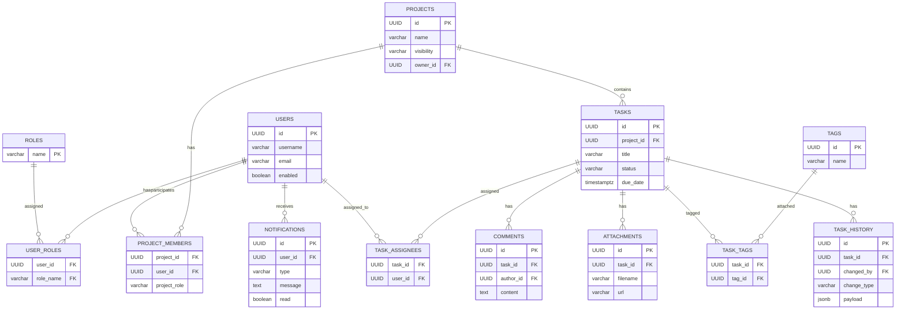

# ERD — TaskFlow API

Le diagramme suivant décrit les entités principales et leurs relations (Mermaid ERD).

Notes:
- Les identifiants sont conçus comme `UUID` pour faciliter la fusion et la distribution.
- Les historiques (`TASK_HISTORY`) et notifications sont persistés pour audit et affichage in-app.
